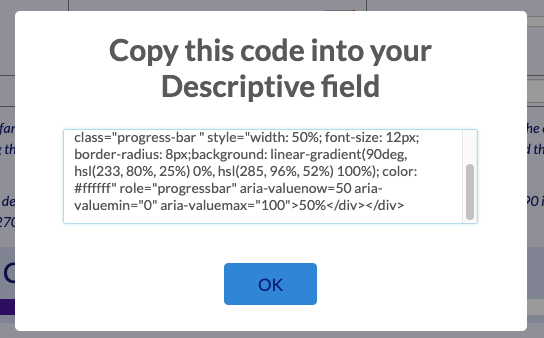

# REDCap Progress Bar Wizard

[![CC BY-NC-SA 4.0][cc-by-nc-sa-shield]][cc-by-nc-sa]

Do you have users who want aesthetically pleasing HTML progress bars but who struggle with the code? Do you often come to their rescue and build progress bars for them?

Well my fellow admins, down tools! Those users can now take advantage of my [REDCap Progress Bar Wizard][wiz] to design their own HTML progress bars using their project colourscheme, with custom text, and a range of other customisations, and with a click of a button be shown the HTML code that they can drop right in place in their project.

So please, save yourself the pain of coding progress bars for your users – I've borne that pain for you in developing this utility.

Access the wizard here: [redcap.link/pbwiz][wiz], or clone this repository and remix for your own audience, including attribution to the original author.

## Screenshots

## Acknowledgements

This idea came from John Liman after the 2022 A/NZ Admin Forum in Melbourne, at which I gave, on the user day, a talk that included some snippets of HTML code for building progress bars as examples of ways project designers can improve the survey participant experience. John suggested I create a survey that takes some user-defined options around width, height, colours and so on, and generates the code. He really wanted an easy way to get Font Awesome glyphs in the progress bar, but this in particular has proven too difficult.

And after getting some more help from Gunther Rezniczek, specifically around the colour pickers he has in his certificate generator, I think it's now ready to release, at least as version 1.

## Todo

I plan to incorporate more configuration, perhaps a middle colour for the gradient, shadow and other animations, work on the rather lacklustre JS alert as currently the only way to output the code (maybe a better modal with a copy to clipboard button) and I plan to solve the Font Awesome issue (CALCTEXT'ing html tags is fraught with pain), and will update the project with those enhancements as I work on them.

## Licence

This work is licensed under a
[Creative Commons Attribution-NonCommercial-ShareAlike 4.0 International License][cc-by-nc-sa].

[![CC BY-NC-SA 4.0][cc-by-nc-sa-image]][cc-by-nc-sa]

[cc-by-nc-sa]: http://creativecommons.org/licenses/by-nc-sa/4.0/
[cc-by-nc-sa-image]: https://licensebuttons.net/l/by-nc-sa/4.0/88x31.png
[cc-by-nc-sa-shield]: https://img.shields.io/badge/License-CC%20BY--NC--SA%204.0-lightgrey.svg
[wiz]: https://redcap.link/pbwiz
